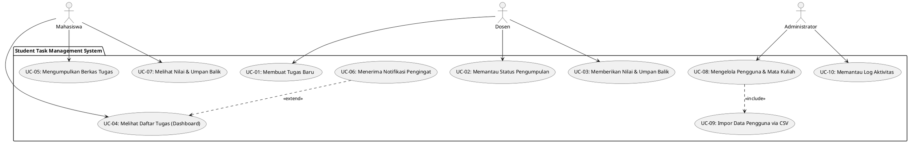

# Use Case Description: Student Task Management System

Dokumen ini berisi spesifikasi deskripsi Use Case untuk Student Task Management System beserta kode PlantUML yang dapat diimpor langsung ke draw.io.

---

## Kode PlantUML (Salin ke Draw.io via Arrange -> Insert -> Advanced -> PlantUML)

---

## Daftar Use Case dan Deskripsi Tekstual

### UC-01: Membuat Tugas Baru
- **Aktor**: Dosen
- **Deskripsi**: Dosen membuat tugas kuliah baru yang berisi judul, instruksi deskripsi, tenggat waktu (deadline), bobot nilai persentase, dan file lampiran opsional.
- **Prekondisi**: Dosen telah login ke sistem dan memiliki kelas mata kuliah aktif.
- **Alur Utama**:
  1. Dosen mengakses menu "Buat Tugas".
  2. Sistem menampilkan formulir pengisian tugas.
  3. Dosen mengisi seluruh parameter tugas (wajib mengisi judul, deadline, bobot).
  4. Dosen menekan tombol "Submit".
  5. Sistem menyimpan tugas ke database dan menerbitkannya ke mahasiswa.
- **Relasi**: —
- **FR terkait**: FR-01

### UC-02: Memantau Status Pengumpulan
- **Aktor**: Dosen
- **Deskripsi**: Dosen melihat rekap status pengumpulan tugas oleh mahasiswa untuk mata kuliah tertentu secara real-time.
- **Prekondisi**: Tugas perkuliahan telah diterbitkan (UC-01).
- **Alur Utama**:
  1. Dosen memilih tugas perkuliahan tertentu pada halaman kelola tugas.
  2. Sistem menampilkan daftar mahasiswa beserta status pengumpulan (Belum Dikumpulkan / Sudah Dikumpulkan / Terlambat).
- **Relasi**: —
- **FR terkait**: FR-02 (dari sudut pandang rekap dosen)

### UC-03: Memberikan Nilai & Umpan Balik
- **Aktor**: Dosen
- **Deskripsi**: Dosen menilai berkas tugas yang diunggah mahasiswa dengan memberikan skor angka dan catatan umpan balik.
- **Prekondisi**: Mahasiswa telah mengunggah berkas tugas (UC-05).
- **Alur Utama**:
  1. Dosen memilih tugas mahasiswa yang sudah dikumpulkan.
  2. Dosen memeriksa berkas tugas.
  3. Dosen memasukkan nilai (0-100) dan umpan balik teks.
  4. Dosen menekan "Simpan Penilaian".
  5. Sistem mencatat nilai dan mengubah status tugas menjadi "Dinilai".
- **Relasi**: —
- **FR terkait**: FR-07

### UC-04: Melihat Daftar Tugas (Dashboard)
- **Aktor**: Mahasiswa
- **Deskripsi**: Mahasiswa memantau seluruh daftar tugas kuliah aktif, tenggat waktunya, dan status pengerjaannya melalui dashboard utama.
- **Prekondisi**: Mahasiswa telah terautentikasi (login) ke dalam sistem.
- **Alur Utama**:
  1. Mahasiswa mengakses halaman dashboard.
  2. Sistem mengambil data tugas aktif mahasiswa dan menampilkannya diurutkan berdasarkan tenggat terdekat.
- **Relasi**: `<<extend>>` ke UC-06 (Sistem memperluas tampilan jika ada notifikasi/pengingat tugas)
- **FR terkait**: FR-02

### UC-05: Mengumpulkan Berkas Tugas
- **Aktor**: Mahasiswa
- **Deskripsi**: Mahasiswa mengunggah berkas pengerjaan tugas (format PDF/ZIP) sebelum tenggat waktu berakhir.
- **Prekondisi**: Mahasiswa mengakses detail tugas aktif dan batas waktu tugas belum terlampaui.
- **Alur Utama**:
  1. Mahasiswa mengklik tombol "Kumpulkan Tugas" pada detail tugas.
  2. Mahasiswa memilih berkas PDF atau ZIP dari penyimpanan lokal.
  3. Mahasiswa menekan tombol "Unggah".
  4. Sistem memvalidasi format file (BR-01) dan ukuran file.
  5. Sistem menyimpan berkas dan menerbitkan bukti konfirmasi tanda terima digital (FR-04).
- **Relasi**: —
- **FR terkait**: FR-03, FR-04, BR-01, BR-02

### UC-06: Menerima Notifikasi Pengingat
- **Aktor**: Mahasiswa
- **Deskripsi**: Sistem mengirimkan notifikasi pengingat otomatis kepada mahasiswa pada H-3 dan H-1 sebelum deadline tugas.
- **Prekondisi**: Mahasiswa memiliki tugas aktif yang belum dikumpulkan.
- **Alur Utama**:
  1. Sistem melacak secara otomatis sisa waktu pengerjaan tugas mahasiswa.
  2. Sistem mengirim pesan pengingat otomatis via email atau notifikasi in-app pada H-3 dan H-1.
- **Relasi**: `<<extend>>` dari UC-04
- **FR terkait**: FR-05

### UC-07: Melihat Nilai & Umpan Balik
- **Aktor**: Mahasiswa
- **Deskripsi**: Mahasiswa melihat skor hasil penilaian dan umpan balik tertulis yang diberikan oleh Dosen setelah tugas dinilai.
- **Prekondisi**: Dosen telah menyimpan penilaian tugas (UC-03).
- **Alur Utama**:
  1. Mahasiswa membuka halaman detail tugas yang telah dikumpulkan.
  2. Sistem menampilkan skor nilai dan catatan umpan balik dari Dosen.
- **Relasi**: —
- **FR terkait**: FR-08

### UC-08: Mengelola Pengguna & Mata Kuliah
- **Aktor**: Administrator
- **Deskripsi**: Administrator menambah, memperbarui, atau menghapus data pengguna (dosen, mahasiswa, admin) dan mata kuliah di sistem.
- **Prekondisi**: Administrator telah login ke dashboard admin.
- **Alur Utama**:
  1. Administrator membuka menu Manajemen Pengguna atau Manajemen Mata Kuliah.
  2. Administrator menambahkan atau mengubah data pada formulir yang disediakan.
  3. Administrator menyimpan perubahan.
- **Relasi**: `<<include>>` UC-09 (dalam kasus penambahan pengguna secara massal)
- **FR terkait**: FR-09, FR-10

### UC-09: Impor Data Pengguna via CSV
- **Aktor**: Administrator
- **Deskripsi**: Administrator mengunggah berkas CSV untuk mendaftarkan akun dosen dan mahasiswa secara massal.
- **Prekondisi**: Administrator memiliki berkas CSV dengan header kolom yang valid.
- **Alur Utama**:
  1. Administrator memilih menu "Impor CSV".
  2. Administrator mengunggah file CSV.
  3. Sistem memproses file dan menambahkan data pengguna baru ke database.
- **Relasi**: `<<include>>` dari UC-08
- **FR terkait**: FR-09

### UC-10: Memantau Log Aktivitas
- **Aktor**: Administrator
- **Deskripsi**: Administrator meninjau riwayat log aktivitas pengguna untuk menjaga audit integritas data akademik.
- **Prekondisi**: Administrator masuk ke panel admin keamanan.
- **Alur Utama**:
  1. Administrator membuka menu "Log Aktivitas".
  2. Sistem menampilkan daftar entri log terurut dari yang terbaru.
- **Relasi**: —
- **FR terkait**: FR-10
